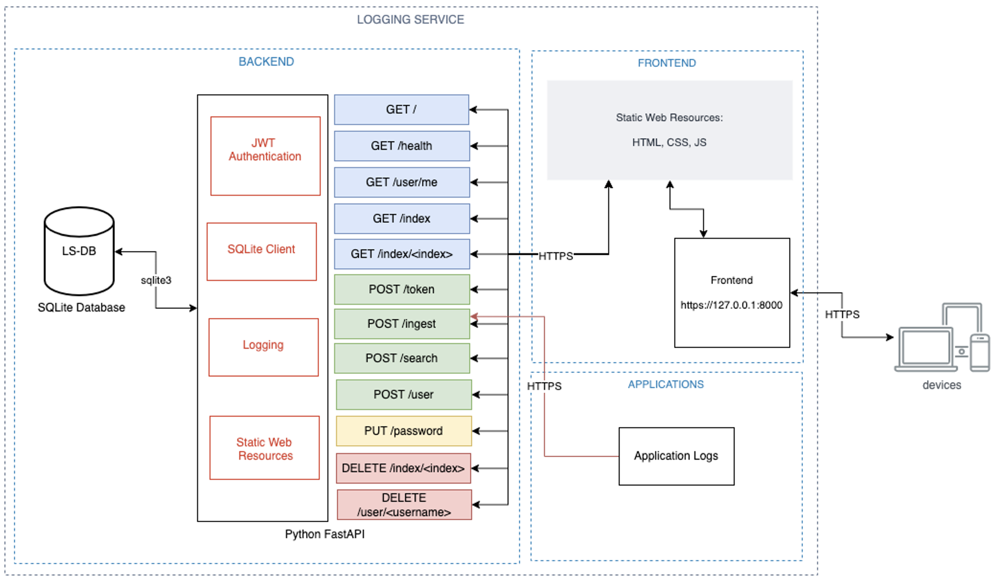

# log-service

This service will enable applications to post logs over HTTPs and provides basic visualisation of those logs in a tabulated form.



The basic functionality is:

- Logs posted in to the service and stored in a database.
- Ability to view all logs, given an index name, including searching over multiple indexes
- Delete logs (Admin users only)
- Create, Update and Delete Users (Admin only)

More documentation can be found in the following files: 

- [Database](./docs/database.md)
- [CICD](./docs/cicd.md)
# Running the application

A number of ways to run the application are provided.

Note: The following browsers are supported to run:
- Edge
- Chrome
- Firefox

Safari does not work!

## Prerequisites

Some prerequisites are required to run the projet:
- Python 3.8 or higher (https://www.python.org/downloads/)
- Pytest (`python3 -m pip install pytest`)
- Docker is optional but recommended. If not installed, see running locally. (https://docs.docker.com/get-docker/)
  
 
## Docker

It is recommended that the application is run with docker.

Run with the following script, which will test, build and run a docker container that can be accessed at the address outputted.

```bash
npm run start:docker
```


## Locally

The application can be run with 

```bash
npm run start:local
```

This script will automatically run tests.

# Login Details

To use the application, two user profiles are provided:
- user
- admin

They both have the password `password`.

# Testing

Tests can be run with 

```bash
npm run test
```


# Set up

Set the following Environment Variables:

|ENV VAR name | Description|
|-|-|
|`LOGGING_DATABASE_PATH`|The full path of the sqlite3 database to connect to|
`LOGGING_SECRET`| Secret used by authentication functions. Can be generated by running `openssl rand -hex 32`|


Then run with 

```bash
cd backend
pipenv shell
pipenv install --deploy
pipenv run uvicorn app.main:app --reload
```

# Authentication

Authentication with JWT Tokens has been implemented. To add auth to a route, copy the following:

```python
def __route_new(current_user: User = Depends(self.get_current_user)):
    
    # Add your method here

    return "Your response"
```

# PipEnv Virtual Environment
To run inside of a virtual environment, run the following commands (requires python 3.8 or above ):

```bash
npm run virtualenv

# You should now be in a virtualenv shell
npm run start:local
```