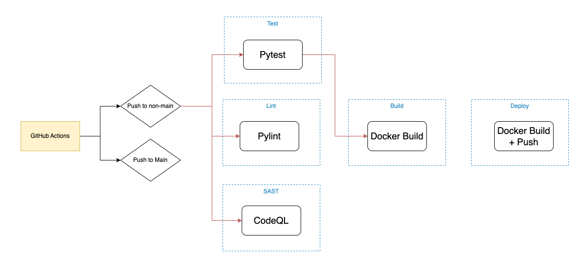
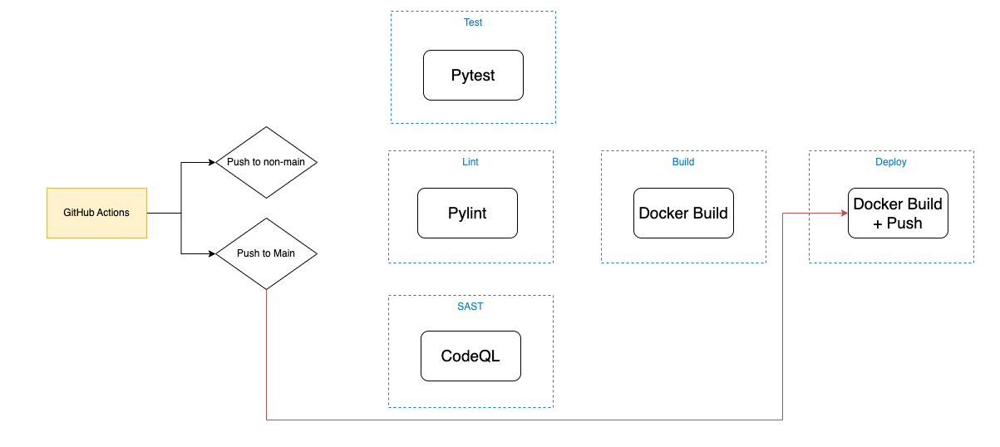

# CI/CD

Comprehensive CICD is achieved using [GitHub Actions](https://docs.github.com/en/actions). 

There are a number of workflows defined, defined below

## Pushes to non-main branches

Upon a commit to any branch but main, [the following actions are run](../.github/workflows/push.yml). Linting is ran using PyLint, which will fail on any errors or warnings. In parallel, static security analysis is ran using CodeQL. Aside from this, the apps tests are ran, and the docker container is built, by not pushed. 

## Pushes to Main 

Upon a commit to main, [the following actions are run](../.github/workflows/main.yml). As the above job will have already ran (any pushes to main must come through a MR from a branch that isn't main), all that happens here is that the docker container is built and pushed to the Github Register (ghcr.io). 

