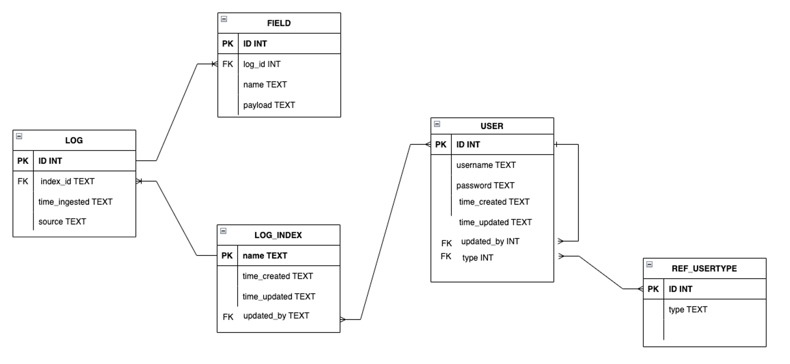

# Database

Data is persisted using SQLite, the most used database engine (2022). Written in C, it is an extremely lightweight implementation of a SQL database that is fast, self-contained, and highly reliable. Python natively supports SQLite.  The database is small, containing 4 data and one reference table; entities and relationships are shown below.

